# Frontend Mentor WPF Solutions

## Overview

I am solving Frontend Mentor challenges using **.NET**, **C#**, **WPF**, and **XAML**. This repository showcases my ability to create pixel-perfect and efficient UI solutions using these technologies. I aim to enhance my development skills through these projects while adhering to best practices and design principles.

## Purpose

The primary goal of this repository is to improve my own skills and demonstrate my capabilities. I am focused on my growth and learning by providing efficient and pixel-perfect UI solutions.

## Technologies

- **[.NET 10](https://dotnet.microsoft.com/en-us/download/dotnet/10.0)**: The latest version of the .NET platform for building and running applications.
- **[C# 14](https://learn.microsoft.com/en-us/dotnet/csharp/whats-new/csharp-14)**: The programming language used to implement the solutions.
- **[WPF](https://learn.microsoft.com/en-us/dotnet/desktop/wpf/overview/?view=netdesktop-10.0)**: Windows Presentation Foundation, used for creating rich desktop applications.
- **[XAML](https://learn.microsoft.com/en-us/dotnet/desktop/wpf/xaml/?view=netdesktop-10.0)**: Extensible Application Markup Language, used for designing the UI in WPF applications.

## Tools

For developing and testing the solutions in this repository, I use the following tools:

- **[Visual Studio 2022](https://visualstudio.microsoft.com/vs/)**: My primary integrated development environment (IDE) for writing, debugging, and running C# code. With its robust features, Visual Studio 2022 streamlines .NET development, offering tools for efficient coding, debugging, and performance optimization.
- **[ReSharper](https://www.jetbrains.com/resharper/)**: A powerful Visual Studio extension that elevates the development experience through advanced code analysis, intelligent refactoring tools, and productivity-enhancing features. ReSharper ensures my code is clean, optimized, and adheres to best practices.
- **[Diffchecker](https://www.diffchecker.com/image-compare/)**: A reliable tool I use to compare screenshots of expected and actual results, ensuring visual consistency and accuracy.
- **[ImgOnline](https://www.imgonline.com.ua/eng/similarity-percent-result.php)**: This tool helps me evaluate the similarity percentage between images, enabling precise verification of visual elements.

## Automation Jobs

I've created automation jobs for this repository to streamline the development process. These jobs are defined in the `dotnet.yml` file and include steps for building the project and checking code style. The jobs run on every push and pull request to the `develop` branch.

## QR Code Component

https://www.frontendmentor.io/challenges/qr-code-component-iux_sIO_H

    
<strong>Screenshots</strong>

  
### Expected Result
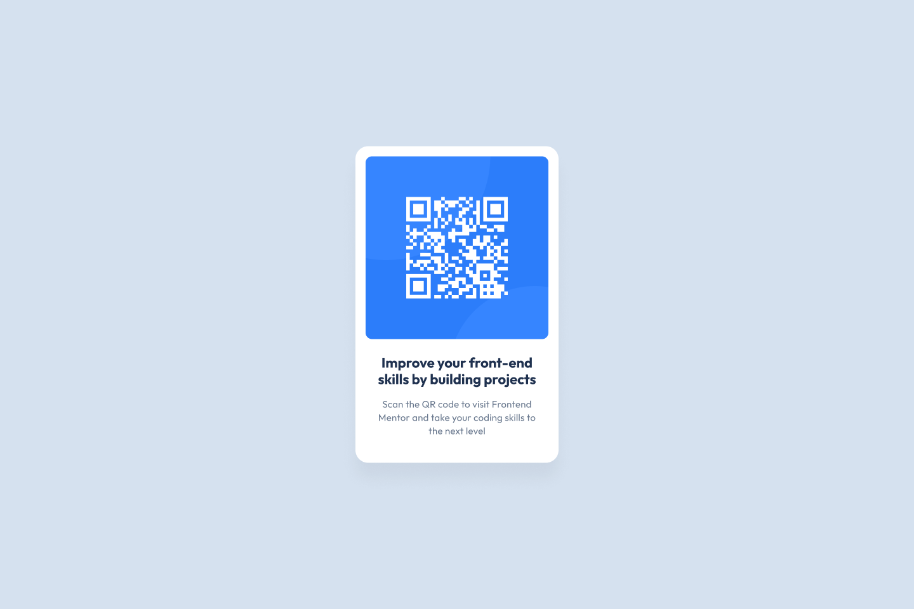

### Actual Result (96.87%)

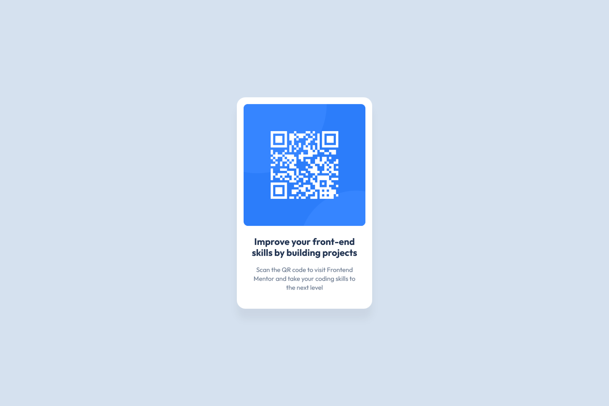

## Social Links Profile

https://www.frontendmentor.io/challenges/social-links-profile-UG32l9m6dQ

    
<strong>Screenshots</strong>

    
### Expected Result
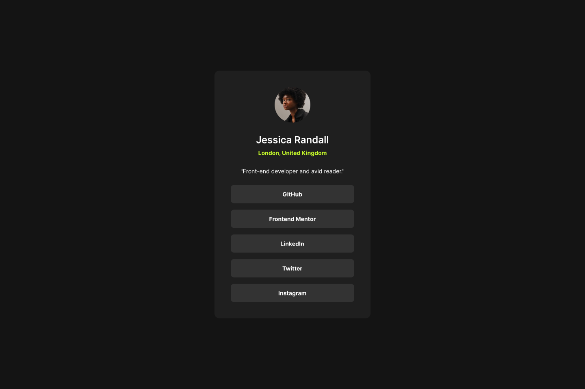

### Actual Result (95.56%)

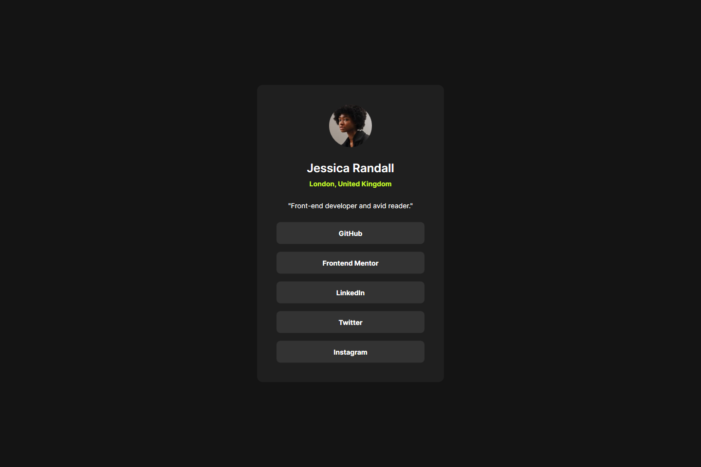

### Expected Result - Active

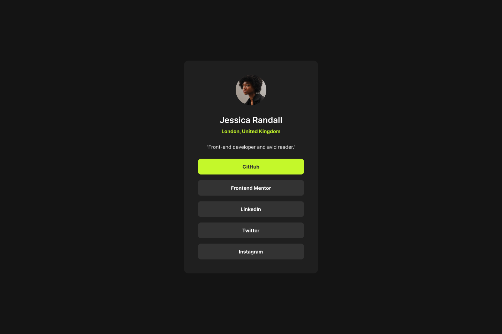

### Actual Result - Active (97.38%)

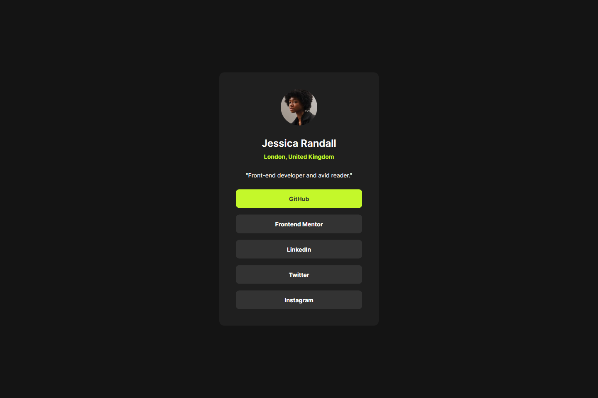

## Blog Preview Card

https://www.frontendmentor.io/challenges/blog-preview-card-ckPaj01IcS

    
<strong>Screenshots</strong>

  
### Expected Result

### Actual Result (99.33%)

### Expected Result - Active

### Actual Result - Active (99.53%)

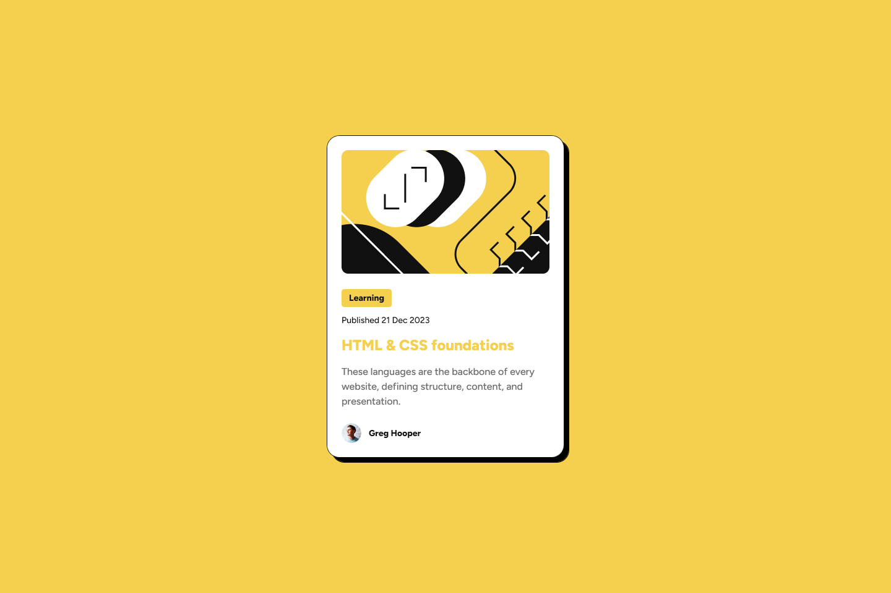

## Results Summary Component

https://www.frontendmentor.io/challenges/results-summary-component-CE_K6s0maV

    
<strong>Screenshots</strong>

  
### Expected Result

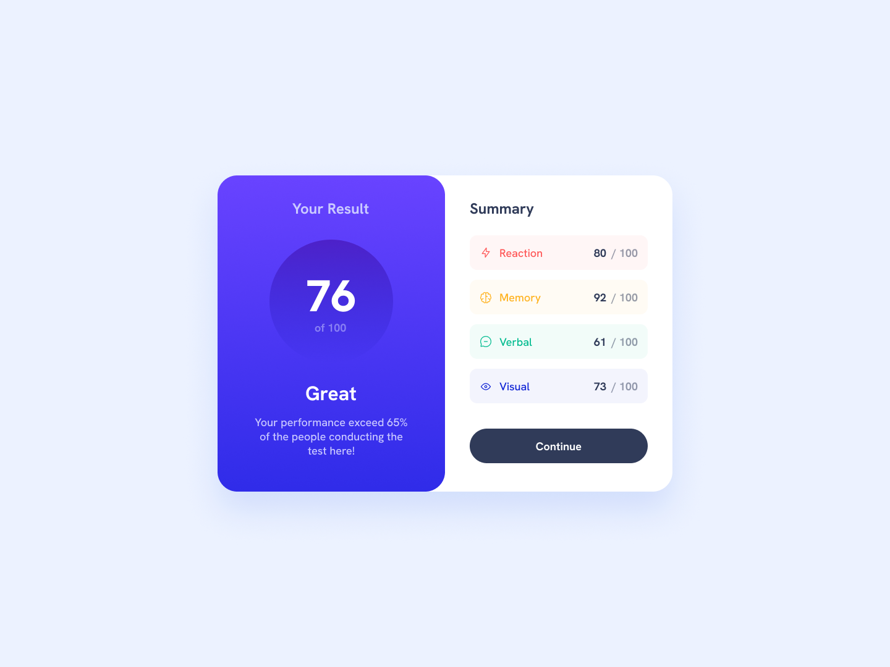

### Actual Result (99.69%)

### Expected Result - Active

### Actual Result - Active (99.15%)

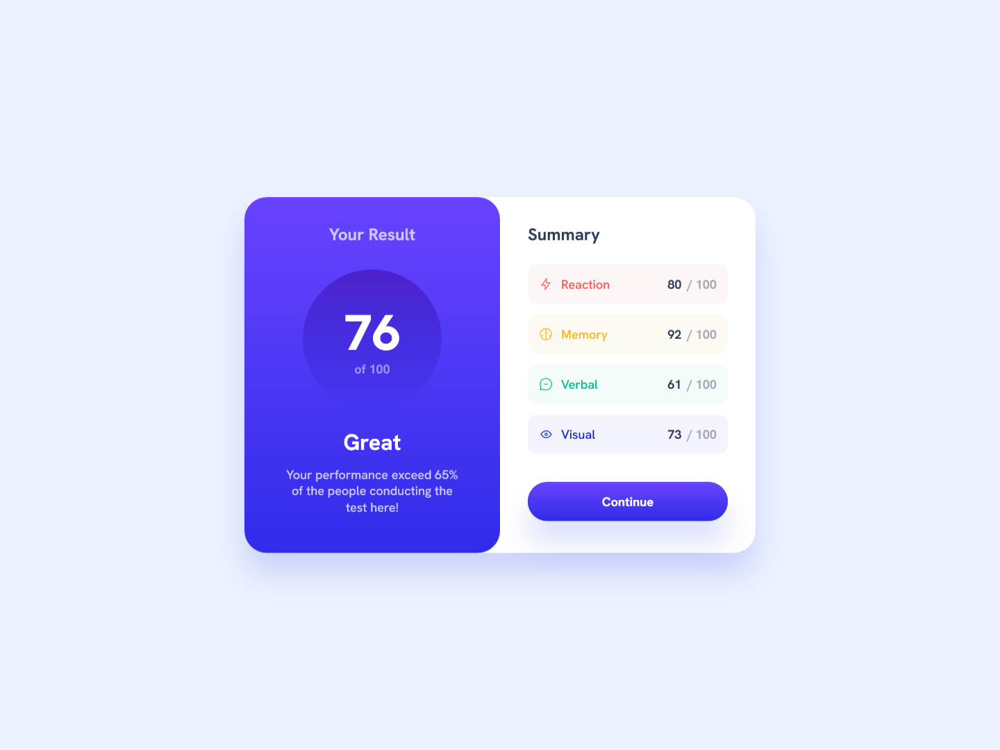

## Three-column preview card component

https://www.frontendmentor.io/challenges/3column-preview-card-component-pH92eAR2-

    
<strong>Screenshots</strong>

  
### Expected Result

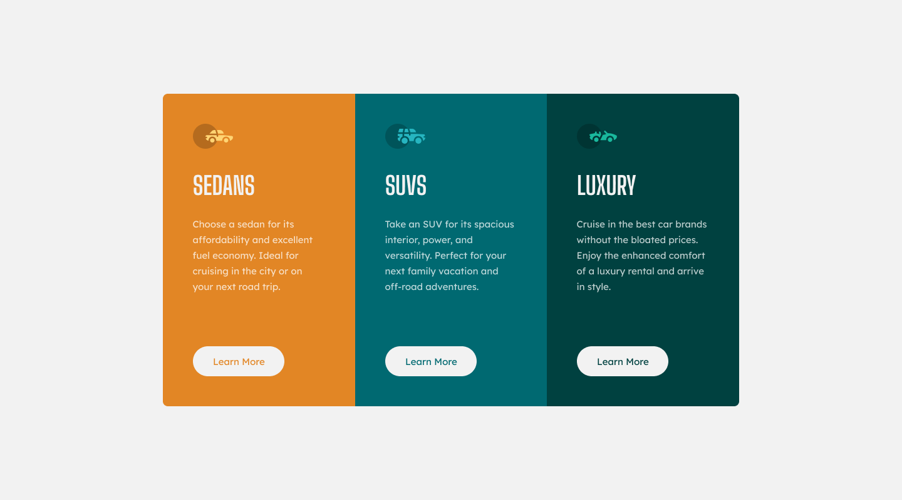

### Actual Result (99.67% identical to the expected result)

### Expected Result - Active

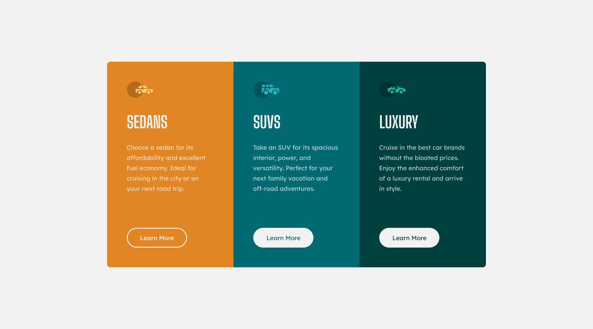

### Actual Result - Active (99.67% identical to the expected result)

## Order summary component

https://www.frontendmentor.io/challenges/order-summary-component-QlPmajDUj

    
<strong>Screenshots</strong>

  
### Expected Result

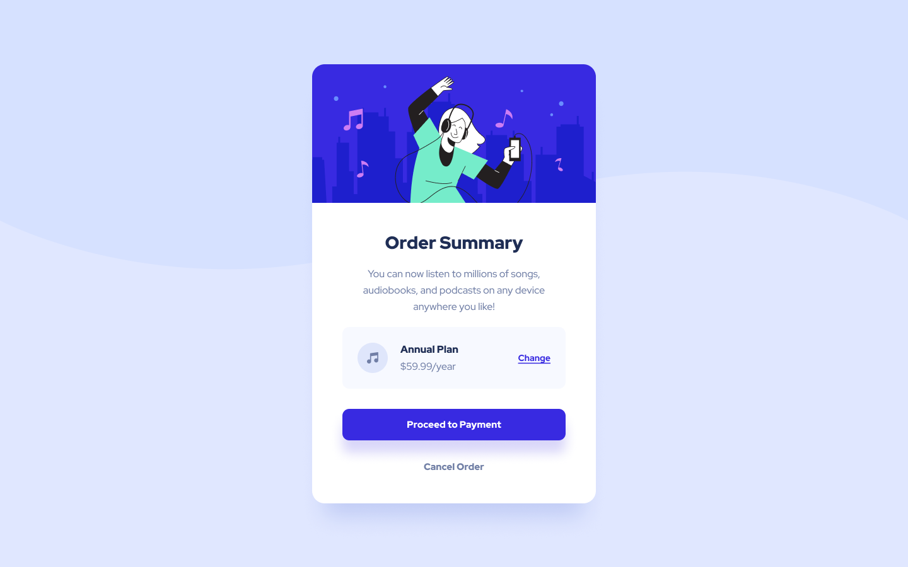

### Actual Result (99.38% identical to the expected result)

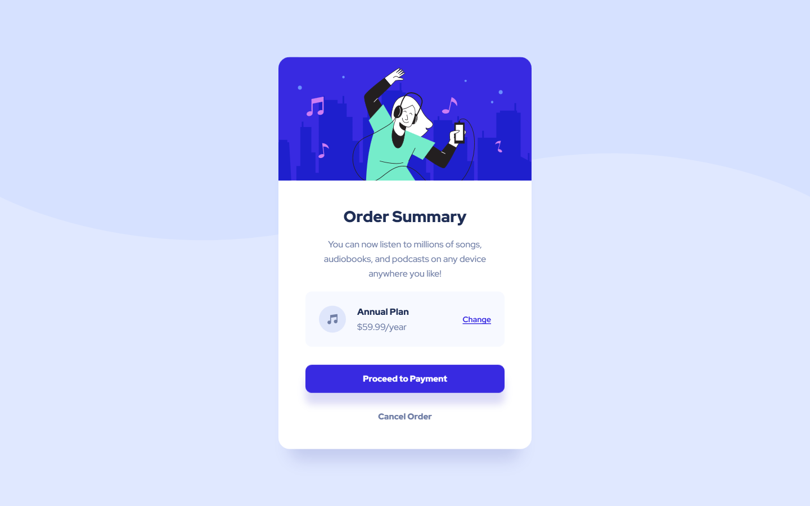

### Expected Result - Change Annual Plan

### Actual Result - Change Annual Plan (99.4% identical to the expected result)

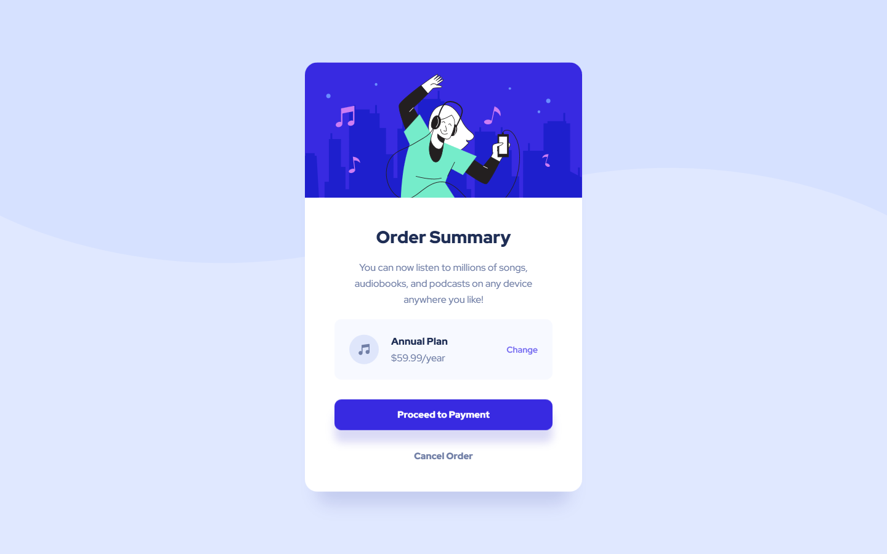

### Expected Result - Proceed to Payment

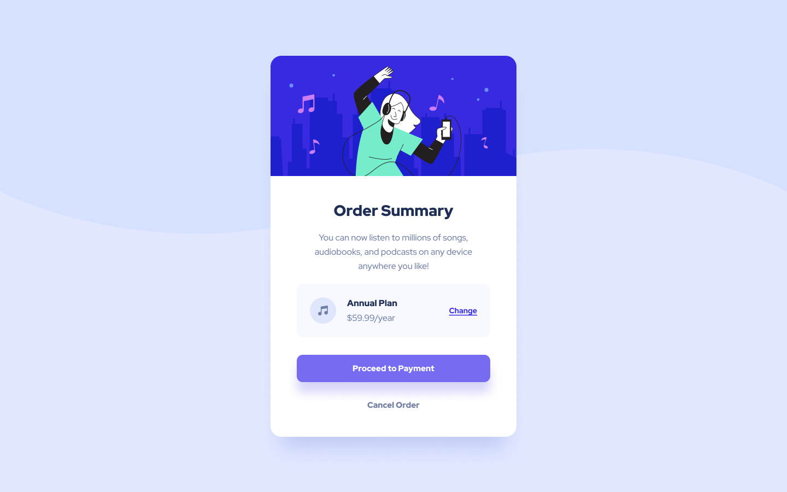

### Actual Result - Proceed to Payment (99.35% identical to the expected result)

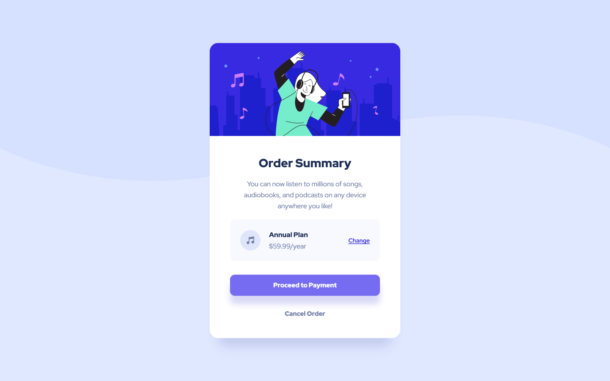

### Expected Result - Cancel Order

### Actual Result - Cancel Order (99.35% identical to the expected result)

## License

This project is licensed under a custom license. See the [LICENSE](LICENSE) file for details.
